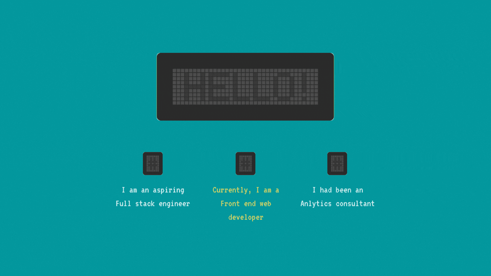

<h2>🤠 Hello! I am Adipta Biswas</h2>
 

  

<ul>
  <li>I hail from Kolkata, India 🇮🇳.</li>
  <li>I'm an aspiring Full-Stack Engineer 🚀.</li> 
  <li>Currently, I'm learning Front-End 👨🏽‍💻.</li>
  <li>I've shifted my career from Data Science 📊.</li>
  <li>Sometimes I write for <a href="https://dev.to/ricky_rick">DEV Community</a> and <a href="https://medium.com/holy-coding">Medium.</a></li>
  <li>I don't believe in miracles 🔮.</li>
  <li>Count me in if you want to plant trees 🌳.</li>
</ul>

<h2>😎 Talking about recent days</h2>
 

  
👾 I am using

   
  <ul>
  <li>Programming languages</li>
    <ul>
      <li></li>
    </ul>
  <li>Markup and Styling languages</li>
    <ul>
      <li>
      <li></li>
      <li></li>
    </ul>
  <li>Prototype and Wireframing tools</li>
    <ul>
      <li></li>
    </ul>
  <li>Code editors</li>
    <ul>
      <li></li>
      <li></li>
    </ul>
  </ul>

 

  
💻 I am learning

   
  <ul>
    <li></li>
    <li></li>
    <li></li>
  </ul>

<h2>🧮 Current profile visit count</h2>
 

<h2>📮 Get in touch with me</h2>
 
<ul>
  <li></li>
   
  <li><a href="https://linkedin.com/in/adipta-biswas-53017820b">
  </li>
</ul>
